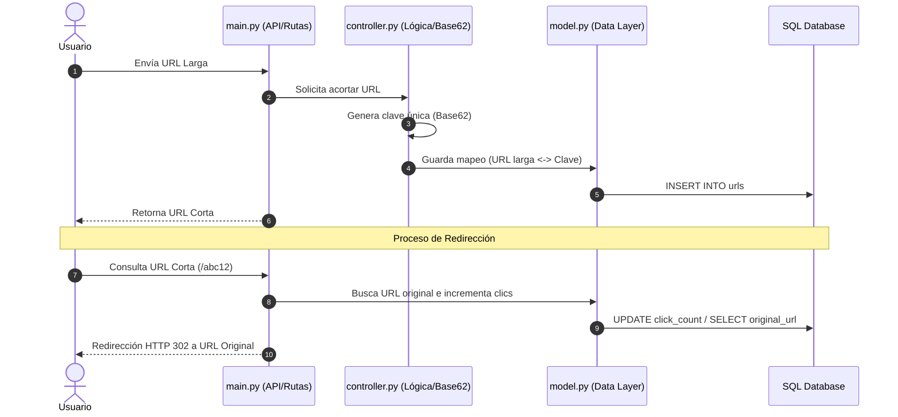

# 🔗 URL Shortening Service (Python MVC & Base62 Encoding)

Español | [English](README.es.md)

Un servicio backend para acortar enlaces de forma eficiente, diseñado bajo el patrón de arquitectura **MVC (Modelo-Vista-Controlador)** en Python, con soporte para redirecciones HTTP, conteo de métricas y algoritmo propio de codificación **Base62**.  

Desarrollada como parte de la serie de desafíos de backend de [roadmap.sh](https://roadmap.sh/projects/url-shortening-service).

---

## ✨ Características Principales

* **🏛️ Arquitectura MVC Limpia:** Separación estricta de capas entre rutas/API (`main.py`), lógica de negocio (`controller.py`), capa de datos (`model.py`) y esquema SQL (`schema.sql`).
* **🔠 Algoritmo de Codificación Base62:** Generación eficiente de claves cortas e identificadores únicos combinando timestamp y caracteres alfanuméricos.
* **📊 Analítica y Métricas:** Seguimiento automático de la cantidad de clics (`click_count`) y timestamps de creación y última actualización.
* **↪️ Redirección HTTP 302:** Manejo correcto del protocolo HTTP para rastrear accesos sin forzar el caché permanente del navegador.
* **🗄️ Persistencia de Datos:** Integración con base de datos SQL (SQLite/PostgreSQL) para la gestión segura de mapeos de URLs.

---

## 📂 Arquitectura del Proyecto

```text
├── main.py            # Capa de presentación y manejo de peticiones/rutas HTTP
├── controller.py      # Lógica de negocio y algoritmo de acortamiento (Base62)
├── model.py           # Capa de acceso a datos (Queries, Insert, Updates)
├── init_database.py   # Script de inicialización idempotente de la BD
├── schema.sql         # Esquema DDL con tabla, índices y restricciones
└── README.md          # Documentación del proyecto
```

## 🛠️ Tecnologías Utilizadas

* **Lenguaje:** Python 3.x
* **Patrón de Diseño:** MVC (`Model-View-Controller`)
* **Base de Datos:** SQL (`SQLite` / `PostgreSQL`)
* **Algoritmo:** Custom `Base62` Encoding

## 🚀 Instalación y Uso
### Prerrequisitos
Tener Python 3 instalado en el sistema.

### Pasos

1. **Clonar el repositorio:**
```bash
  git clone https://github.com/Aki-new/URL-Shortening-Service.git
  cd URL-Shortening-Service
```

2. **Inicializar la Base de Datos:**
```bash
  python init_database.py
```

3. **Ejecutar el servicio:**
```bash
  python main.py
```

## 💡 Flujo de Trabajo (Workflow)


## 📋 Especificación de la API

### 1. Acortar una URL
* **Endpoint:** `POST /shorten`
* **Content-Type:** `application/json`

**Body Request:**
```json
{
  "url": "https://example.com/",
  "shortCode": "example"
}
```
**Nota**: shortCode es opcional; Si no se agrega, se genera uno aleatoriamente.  
**Respuesta:** `(201 Creado)`

```json
{
  "id": 1,
  "url": "https://example.com/",
  "shortCode": "example",
  "createdAt": "2026-07-06T13:25:00Z",
  "updatedAt": "2026-07-06T13:25:00Z",
  "accessCount": 0
}
```
### 2. Redirigir una URL
* **Endpoint:** `GET /yourShortCode`
* **Respuesta:** `(302 Encontrado)` (Redirige al usuario directamente a la URL de destino).

### 3. Recuperar estadísticas de URL
* **Endpoint:** `GET /shorten/yourShortCode/stats`
* **Respuesta:** `(200 OK)`

```json
{
  "id": 1,
  "url": "https://example.com/",
  "shortCode": "yourShortCode",
  "createdAt": "2026-07-06T13:25:00Z",
  "updatedAt": "2026-07-06T13:25:00Z",
  "accessCount": 42
}
```

### 4. Actualizar una URL acortada existente
* **Endpoint:** PUT `/shorten/yourShortCode`
* **Content-Type:** application/json

**Body Request:**
```json
{
  "url": "https://www.linux.org/",
  "shortCode": "linux-web-site"
}
```
* **Nota:** shortCode es opcional si no desea modificarlo
* **Respuesta:** `(200 OK)`
```json
{
  "id": 1,
  "url": "https://www.linux.org/",
  "shortCode": "linux-web-site",
  "createdAt": "2026-07-06T13:25:00Z",
  "updatedAt": "2026-07-06T13:30:00Z",
  "accessCount": 22
}
```

### 5. Eliminar una URL acortada
* Endpoint: `DELETE /shorten/yourShortCode`
* Respuesta: `(204)` Sin contenido
