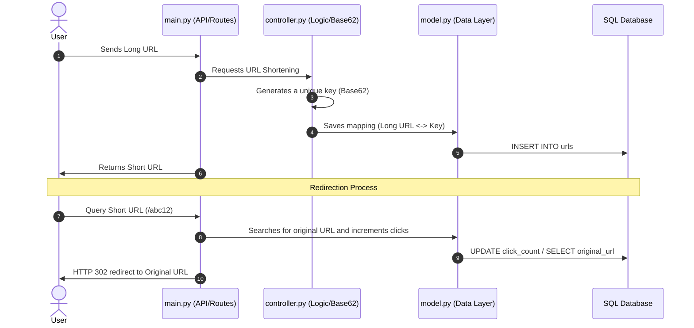

# 🔗 URL Shortening Service (Python MVC & Base62 Encoding)

[Spanish](README.es.md) | English

A backend service for efficiently shortening links, designed using the **MVC (Model-View-Controller)** architectural pattern in Python, with support for HTTP redirects, metric tracking, and a custom **Base62** encoding algorithm.

Developed as part of the backend challenge series at [roadmap.sh](https://roadmap.sh/projects/url-shortening-service).

---

## ✨ Main Features

* **🏛️ Clean MVC Architecture:** Strict separation of layers between routes/APIs (`main.py`), business logic (`controller.py`), data layer (`model.py`), and SQL schema (`schema.sql`).

* **🔠 Base62 Encoding Algorithm:** Efficient generation of short keys and unique identifiers by combining timestamps and alphanumeric characters.

* **📊 Analytics and Metrics:** Automatic tracking of click count (`click_count`) and creation and last update timestamps.

* **↪️ HTTP 302 Redirect:** Proper handling of the HTTP protocol to track access without forcing the browser's permanent cache.

* **🗄️ Data Persistence:** Integration with SQL databases (SQLite/PostgreSQL) for secure URL mapping management.

---

## 📂 Project Architecture

```text
├── main.py # Presentation layer and HTTP request/route handling
├── controller.py # Business logic and shortening algorithm (Base62)
├── model.py # Data access layer (Queries, Inserts, Updates)
├── init_database.py # Idempotent database initialization script
├── schema.sql # DDL schema with tables, indexes, and constraints
└── README.md # Project documentation
```

## 🛠️ Technologies Used

* **Language:** Python 3.x
* **Design Pattern:** MVC (Model-View-Controller)
* **Database:** SQL (SQLite / PostgreSQL)
* **Algorithm:** Custom Base62 Encoding

## 🚀 Installation and Use
### Prerequisites
Python 3 must be installed on your system.

### Steps

1. **Clone the repository:**
```bash
git clone https://github.com/Aki-new/URL-Shortening-Service.git
cd URL-Shortening-Service
```

2. **Initialize the Database:**
```bash
python init_database.py
```

3. **Run the service:**
```bash
python main.py
```

## 💡 Workflow


## 📋 API Specification

### 1. Shorten a URL
* **Endpoint:** `POST /shorten`
* **Content-Type:** `application/json`

**Body Request:**
```json
{
  "url": "https://example.com/",
  "shortCode": "example"
}
```
**Note**: ShortCode is optional; if not added, one is generated randomly.

**Response:** `(201 Created)`

```json
{
  "id": 1,
  "url": "https://example.com/",
  "shortCode": "example",
  "createdAt": "2026-07-06T13:25:00Z",
  "updatedAt": "2026-07-06T13:25:00Z",
  "accessCount": 0
}
```
### 2. Redirecting a URL
* **Endpoint:** `GET /yourShortCode`
* **Response:** `(302 Found)` (Redirects the user directly to the destination URL).

### 3. Retrieve URL statistics
* **Endpoint:** `GET /shorten/yourShortCode/stats`
* **Response:** `(200 OK)`

```json
{ 
  "id": 1, 
  "url": "https://example.com/", 
  "shortCode": "yourShortCode", 
  "createdAt": "2026-07-06T13:25:00Z", 
  "updatedAt": "2026-07-06T13:25:00Z", 
  "accessCount": 42
}
```

### 4. Update an existing shortened URL
* **Endpoint:** PUT `/shorten/yourShortCode`
* **Content-Type:** application/json

**Body Request:**
```json
{ 
  "url": "https://www.linux.org/",
  "shortCode": "linux-web-site"
}
```
* **Note:** shortCode is optional if you don't want to modify it
* **Response:** `(200 OK)`
```json
{
  "id": 1,
  "url": "https://www.linux.org/",
  "shortCode": "linux-web-site",
  "createdAt": "2026-07-06T13:25:00Z",
  "updatedAt": "2026-07-06T13:30:00Z",
  "accessCount": 22
}
```

### 5. Delete a shortened URL
* Endpoint: `DELETE /shorten/yourShortCode`
* Response: `(204)` No content
